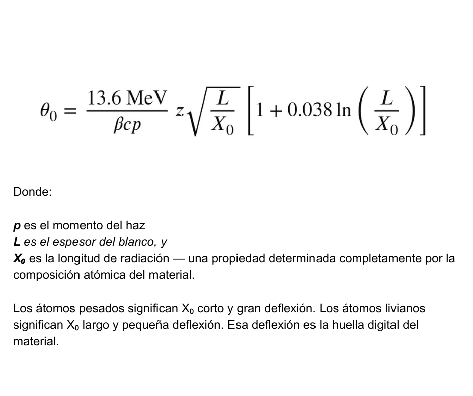
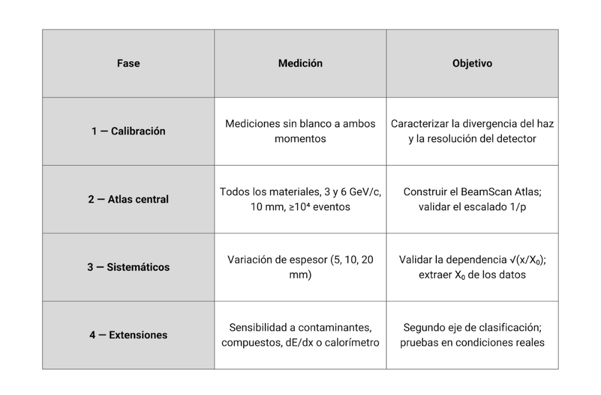

# BeamScan: Un Clasificador de Materiales por Haz de Partículas — Del Reciclaje al Patrimonio Cultural

**Equipo:** Álvarez Jeremías, Baraldo Vargas Paula, Blanco Tomás, Bustillo Federico, Carabajal Ricardo, Cores Fiorella, Medina Giovanini Lorenzo, Rodríguez Matías, Yallbi Maia.
**Coaches:** García Iskya, Rodríguez Agustina
**Asesor:** Sánchez Pineda Arturo

**Instituto San Francisco de Asís, Santa Rosa de Calamuchita, Córdoba, Argentina.**
**Marzo de 2026**

## 1. Motivación para Participar

Somos estudiantes y docentes del Instituto San Francisco de Asís en Santa Rosa de Calamuchita, Córdoba, Argentina. Hace 2.000 años, el pueblo Comechingón talló y dio forma a las rocas de nuestra región — y esos artefactos todavía no pueden estudiarse sin riesgo de dañarlos. Hoy, un solo trozo de PVC, indistinguible a simple vista, puede contaminar un lote entero de reciclaje [1].  El mismo desafío, 2.000 años después: caracterizar un material sin destruirlo. La física de partículas ofrece una respuesta para ambos casos: la dispersión múltiple de Coulomb revela la composición atómica a través de los ángulos de deflexión. Participar en BL4S significa que finalmente podremos demostrarlo.

---

## 2. Idea del Experimento

## La Pregunta

¿Podemos construir un "BeamScan Atlas" — una tabla de clasificación que identifique materiales midiendo cómo las partículas cargadas se dispersan al atravesarlos? Nuestro objetivo es demostrarlo para dos campos del mundo real en un solo experimento: identificar plásticos para el control de calidad en el reciclaje y clasificar materiales geológicos de referencia, relevantes para el patrimonio cultural.

## La Física

Cuando una partícula cargada viaja a través de la materia a energías del orden de los GeV, no sigue una trayectoria recta — se desvía levemente cada vez que pasa cerca de un núcleo atómico. El efecto acumulativo de miles de estas pequeñas desviaciones se denomina dispersión múltiple de Coulomb (MCS) [2]. La dispersión angular resultante θ₀ sigue la fórmula de Highland:

## Separación Predicha

Usando la fórmula de Highland con las longitudes de radiación del PDG [3], calculamos los ángulos de dispersión esperados a 3 GeV/c en blancos de 10 mm. Los resultados se dividen naturalmente en dos familias: Plásticos (C, H, O, N — átomos livianos, X₀ largo): PE y PP se ubican en θ₀ ≈ 0,56 mrad, característicos del carbono-hidrógeno puro. PS, PMMA y PET siguen entre 0,60 y 0,74 mrad. El PVC se destaca en θ₀ ≈ 0,90 mrad — su átomo de cloro (Z = 17) aumenta dramáticamente la dispersión. Materiales geológicos (Si, Ca, Al, Fe): cuarzo, calcita, alúmina y óxido de hierro dispersan a θ₀ = 1,17–2,38 mrad, bien separados del grupo de plásticos. Esa brecha es, en sí misma, el resultado científico: el MCS ordena naturalmente los materiales por composición. Nuestras simulaciones en Geant4 [4] confirman que incluso los pares más cercanos (PS vs PMMA) necesitan menos de 2.000 eventos a 3σ — segundos de tiempo de haz. PVC versus PE necesita solo ~50 eventos. El atlas completo requiere menos de una hora de datos.

Figura 1: Matriz de discriminación. Número de eventos necesarios para una separación de 3σ entre cada par de materiales a 3 GeV/c, 10 mm de espesor. PE/PP es el par más difícil de distinguir; la mayoría de las separaciones entre familias requieren menos de 100 eventos.

## Configuración Experimental (independiente de la instalación)

Nuestra medición central requiere únicamente cuatro Delay Wire Chambers (DWCs) [5] y un soporte de blancos — equipamiento estándar en todas las instalaciones de BL4S:

Figura 2: Representación esquemática de la configuración experimental de BeamScan (independiente de la instalación).

Dos trazadores antes del blanco miden la dirección de la partícula entrante, y dos la miden después del blanco.
Sustrayendo la divergencia natural del haz — medida en runs sin blanco — extraemos la señal de dispersión del material únicamente. La configuración funciona con DWCs en el CERN, telescopios de haz en DESY [6], y los detectores de trazas disponibles en ELSA [7].

## Blancos y Consideraciones por Instalación

El CERN y DESY aceptan únicamente blancos no combustibles; ELSA también permite materiales combustibles. Nuestro plan se adapta en consecuencia: en ELSA medimos el conjunto completo — plásticos (PE, PP, PS, PMMA, PET, Nylon, PVC) [8] más referencias geológicas (cuarzo, calcita, alúmina, óxido de hierro) [9], incluyendo el "resultado clave" del PVC. En CERN o DESY medimos las referencias geológicas más grafito y láminas metálicas como referencias de bajo Z — cubriendo aún un amplio rango de X₀.

## Programa de Medición

## El Producto: BeamScan Atlas

Una tabla de clasificación y gráfico de θ₀ (y X₀ extraída) para cada material. Cada punto de datos tiene una interpretación física, una aplicación en el mundo real y una predicción de simulación con la que comparar. De estar disponible, un segundo eje (p. ej. dE/dx o respuesta del calorímetro) fortalece la clasificación. El atlas es un resultado científico, una referencia práctica y una visualización memorable.

Figura 3: Separación natural de materiales y diferencia resultante en el ángulo de dispersión. Izquierda: La longitud de radiación frente al número atómico efectivo muestra una clara separación entre los materiales orgánicos (bajo Z) e inorgánicos (alto Z). Derecha: Los ángulos de dispersión correspondientes a 3 GeV/c (10 mm de espesor) revelan una diferencia natural entre las dos clases de materiales.

## Simulación y Ciencia Abierta

Hemos construido una simulación Monte Carlo en Geant4 del experimento completo, publicada en un repositorio público de GitHub. Cada figura puede reproducirse editando un archivo YAML simple — sin necesidad de utilizar C++ ni Geant4. Nuestras simulaciones (Geant4 11.3.2, FTFP_BERT, 2.000 eventos por configuración) validan las predicciones de Highland: en 10 de 11 materiales a dos momentos, Geant4 supera consistentemente a Highland en un 12 ± 3%, atribuible a la dispersión nuclear elástica que la fórmula analítica omite. La excepción es Fe₂O₃, donde la relación sube a ~1,4–1,5 — evidenciando la mayor sección eficaz hadrónica de los núcleos de hierro —un resultado que también puede medirse con la misma configuración. Este desvío calibrará nuestro análisis: comparar datos reales con Highland y Geant4 nos permitirá separar aproximaciones analíticas de efectos genuinos del detector.

Figura 4: Relación Geant4/Highland para todos los materiales a 3 y 6 GeV/c. La mayoría de los materiales cae dentro de la banda del 12 ± 3%, consistente con la dispersión nuclear elástica omitida por Highland. Fe₂O₃ es una anomalía clara, que revela la mayor sección eficaz hadrónica de los núcleos de hierro.

## 3.Lo que esperamos llevarnos

Queremos volver a Córdoba con un BeamScan Atlas validado, la experiencia de haber realizado un experimento real en una instalación de clase mundial, y una historia para compartir. Si estudiantes de Argentina pueden usar una el haz de partículas del CERN para ayudar a resolver desafíos de reciclaje y estudiar el patrimonio arqueológico de su país, es una prueba de que la física fundamental le pertenece a todos. Compartiremos nuestros resultados con cooperativas, escuelas y museos locales — y publicaremos todo abiertamente para que el trabajo continúe más allá de nosotros.

## 4. Agradecimientos

Queremos agradecer sinceramente a Arturo Sánchez Pineda (Doctor en Física Fundamental, Ingeniero DevOps Senior e Investigador) por su guía y apoyo durante todo el proyecto, y al Museo Estanislao Baños (Santa Rosa de Calamuchita) por abrirnos sus puertas — su colección y archivo son la raíz de la dimensión patrimonial de BeamScan.

## Actividad de Divulgación

Construimos un sitio web público — el [BeamScan Atlas](https://los-topos-cosmicos.github.io/beam4school-proposal/) donde cualquier persona puede ver los resultados de nuestro experimento: cómo cada material produce un ángulo de dispersión diferente, por qué ocurre físicamente y qué significa para el reciclaje o el patrimonio cultural. Todos los datos son descargables y abiertos.
También creamos un repositorio de GitHub con nuestras simulaciones Geant4, scripts de análisis, datos crudos y tutoriales en español e inglés. La idea es que cualquier estudiante — en cualquier lugar de América Latina — pueda hacer un fork del repositorio, editar un archivo YAML y obtener su propia predicción de dispersión en unos 30 segundos, sin instalar nada. Quisimos que se sintiera como algo tangible.
Finalmente, estamos organizando actividades de divulgación en nuestra comunidad — en la cooperativa municipal, el museo del pueblo y nuestra escuela. Al participar en la feria de ciencias de nuestro colegio, quedamos habilitados para competir a nivel regional y nacional, por lo que nuestros resultados podrían llegar a audiencias mucho más allá de Santa Rosa de Calamuchita. En cada instancia, el mensaje es el mismo: la física detrás de nuestro experimento puede ayudar a identificar una roca comechingona de 2.000 años y detectar PVC en una planta de reciclaje.
La física fundamental le pertenece a todos.

## Bibliografía

[1] M. Paci and F. P. La Mantia,
"Influence of small amounts of polyvinylchloride on the recycling of polyethyleneterephthalate,"
*Polymer Degradation and Stability*, vol. 63, no. 1, pp. 11–14, Jan. 1999.
https://doi.org/10.1016/S0141-3910(98)00053-6

[2] D. E. Groom and S. R. Klein,
"Passage of Particles Through Matter,"
in *Review of Particle Physics 2025*, Particle Data Group, 2025.
https://pdg.lbl.gov/2025/reviews/rpp2025-rev-passage-particles-matter.pdf

[3] Particle Data Group,
"Atomic and Nuclear Properties of Materials,"
in *Review of Particle Physics*, 2025.
https://pdg.lbl.gov/2025/AtomicNuclearProperties/

[4] Geant4 Collaboration,
*Geant4 User's Guide for Application Developers*.
http://geant4.web.cern.ch/

[5] A. Adıgüzel, E. Ergenlik, S. Gürbüz, Z. İstemihan, V. E. Özcan, and G. Ünel,
"Design, simulation and construction of a delay wire chamber,"
in *AIP Conference Proceedings*, vol. 1935, 070003,
33rd International Physics Congress of the Turkish Physical Society (TPS),
Bodrum, Türkiye, 6–10 Sept. 2017.
https://doi.org/10.1063/1.5025984

[6] H. Jansen, S. Spannagel, J. Behr, *et al.*,
"Performance of the EUDET-type beam telescopes,"
*EPJ Techniques and Instrumentation*, vol. 3, 7 (2016).
https://doi.org/10.1140/epjti/s40485-016-0033-2

[7] Physikalisches Institut, Universität Bonn,
"Hadron Physics – ELSA."
https://www-elsa.physik.uni-bonn.de/Hadronenphysik/index_en.html

[8] M. Tsakona and I. Rucevska,
"Plastic Waste Background Report,"
Secretariat of the Basel Convention, Plastic Waste Partnership Working Group,
Beau Vallon, Seychelles, 2–5 Mar. 2020.
https://gridarendal-website-live.s3.amazonaws.com/production/documents/:s_document/554/original/UNEP-CHW-PWPWG.1-INF-4.English.pdf

[9] M. Okrusch and H. E. Frimmel,
*Mineralogy: An Introduction to Minerals, Rocks, and Mineral Deposits*.
Springer, 2020.
https://doi.org/10.1007/978-3-662-57316-7

**Hecho con ❤️ in Córdoba, Argentina para CERN Beamline for Schools 2026**

🇦🇷 → 🔬 → 🌍

*¡La física fundamental es para todos!*

